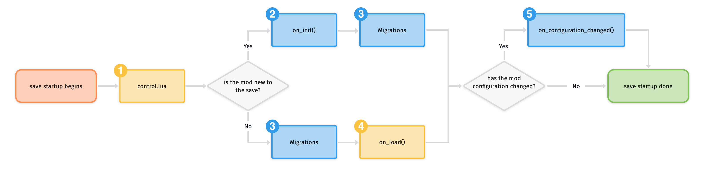

# nzh_factorio_mod
Factorio's mod

异星工厂 Factorio 自用 mod

预计会整合个人日常使用的辅助性工具

## 支持的功能

- [x] 游戏速度调整，基于 TimeTools
  
  改变游戏速度，减慢、加快。

- [ ] 手搓一切，基于 hand_craft_everything

- [ ] 火车自动上色，基于 Automatic Train Painter

- [ ] 传送带反转，基于 Belt Reverser
- [ ] 生产瓶颈分析 belt-reverserup_0.0.9
- [ ] 死亡地点标记 DeathMarkers_0.4.0
- [ ] 地图颜色改进 Enhanced_Map_Colors_1.5.5
- [ ] 自动填充 Fill4Me-fixed_0.10.1，even-distribution_1.0.10
- [ ] 视野与地图缩放 Kux-Zooming_2.2.8
- [ ] 采矿规划 mining-patch-planner_1.4.3
- [ ] 油井规划 WellPlanner_1.1.5
- [ ] 无水管道泵 PumpAnywhere_0.1.10
- [ ] 穿墙 Squeak Through_1.8.2
- [x] 更小的模块装备 Tiny_Equipment_1.1.0
- [ ] 夜视仪 VilsClearNightvision_1.0.1
- [ ] 自适应移速 adaptive_movement_speed_0.3.0
- [ ] 操作距离
- [ ] 地图模式操作

## 模组开发

- 变量名
  `nzh_功能名_类型_名称`

## 模组逻辑

需要实现的接口

| 函数                                                         | 参数 | 返回值 |                             描述                             |
| ------------------------------------------------------------ | ---- | ------ | :----------------------------------------------------------: |
| [on_init](https://lua-api.factorio.com/latest/LuaBootstrap.html#LuaBootstrap.on_init)(handler) |      |        |     Register a function to be run on mod initialization.     |
| [on_load](https://lua-api.factorio.com/latest/LuaBootstrap.html#LuaBootstrap.on_load)(handler) |      |        |         Register a function to be run on save load.          |
| [on_configuration_changed](https://lua-api.factorio.com/latest/LuaBootstrap.html#LuaBootstrap.on_configuration_changed)(handler) |      |        | Register a function to be run when mod configuration changes. |
