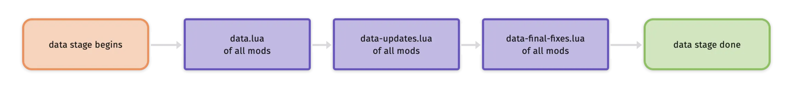
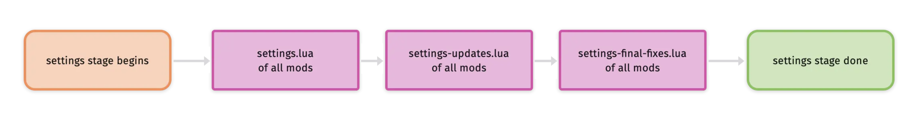

# nzh_factorio_mod

Factorio's mod

异星工厂 Factorio 自用 mod

整合个人日常使用的辅助性工具

## 支持的功能

- [ ] 火车自动上色，基于 Automatic Train Painter
- [ ] 传送带反转，基于 Belt Reverser
- [ ] 生产瓶颈分析 belt-reverserup_0.0.9
- [ ] 死亡地点标记 DeathMarkers_0.4.0
- [ ] 地图颜色改进 Enhanced_Map_Colors_1.5.5
- [ ] 自动填充 Fill4Me-fixed_0.10.1，even-distribution_1.0.10
- [ ] 视野与地图缩放 Kux-Zooming_2.2.8
- [ ] 采矿规划 mining-patch-planner_1.4.3
- [ ] 油井规划 WellPlanner_1.1.5
- [ ] 穿墙 [Squeak Through](https://mods.factorio.com/mod/Squeak%20Through)
- [x] 开局装备

|      名称      | 数量 |
| :------------: | :--: |
|    蜘蛛机甲    |  1   |
|  蜘蛛机甲遥控  |  1   |
|  能量装甲 MK2  |  1   |
| 能量盾模块 MK2 |  20  |
|   外骨骼模块   |  20  |
|   聚变堆模块   |  20  |
|  激光防御模块  |  20  |
| 机器人指令模块 |  18  |
|    夜视模块    |  1   |
|    锚定模块    |  1   |
| 机器人指令平台 |  14  |
|   建设机器人   | 100  |
|    太阳能板    | 720  |
|     电池组     | 600  |
|    小电线杆    |  50  |
|    中电线杆    |  50  |
|    大电线杆    |  50  |
|     配电站     | 114  |
|      雷达      |  50  |

- [ ] 自适应移速 [adaptive_movement_speed](https://mods.factorio.com/mod/adaptive_movement_speed)
- [ ] 地图模式操作

| 功能           | 目录                 | 参考                                                         |
| -------------- | -------------------- | ------------------------------------------------------------ |
| 夜视仪         | data-updates.lua     | [VilsClearNightvision](https://mods.factorio.com/mod/VilsClearNightvision) |
| 操作距离       | long_reach           |                                                              |
| 更小的模块装备 | data.lua             | [Tiny_Equipment](https://mods.factorio.com/mod/Tiny_Equipment) |
| 无水管道泵     | data.lua             | [PumpAnywhere](https://mods.factorio.com/mod/PumpAnywhere)   |
| 调整游戏速度   | time                 | [TimeTools](https://mods.factorio.com/mod/TimeTools)         |
| 手搓一切       | data-final-fixes.lua | [hand_craft_everything](https://mods.factorio.com/mod/hand_craft_everything) |
| 初始物品       | startup              |                                                              |
|                |                      |                                                              |
|                |                      |                                                              |
|                |                      |                                                              |

## 模组逻辑

需要实现的接口

| 函数                                                         | 参数 | 返回值 |                             描述                             |
| ------------------------------------------------------------ | ---- | ------ | :----------------------------------------------------------: |
| [on_init](https://lua-api.factorio.com/latest/LuaBootstrap.html#LuaBootstrap.on_init)(handler) |      |        |     Register a function to be run on mod initialization.     |
| [on_load](https://lua-api.factorio.com/latest/LuaBootstrap.html#LuaBootstrap.on_load)(handler) |      |        |         Register a function to be run on save load.          |
| [on_configuration_changed](https://lua-api.factorio.com/latest/LuaBootstrap.html#LuaBootstrap.on_configuration_changed)(handler) |      |        | Register a function to be run when mod configuration changes. |

